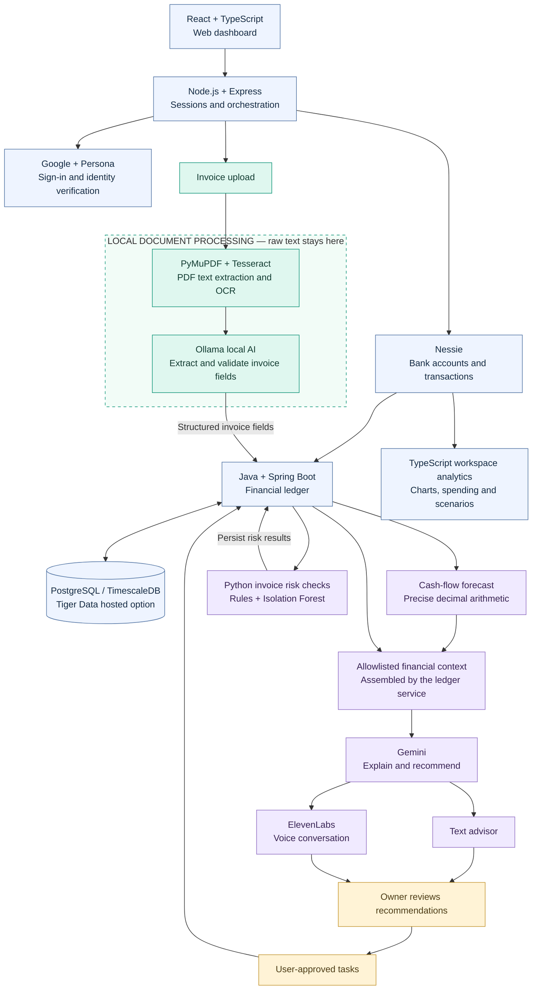

# current.surf

**Cash-flow intelligence with local document AI.**

current.surf helps small businesses understand their cash position, spot upcoming shortages, review unusual invoices, and decide what to do next. It combines bank activity and invoice obligations with financial forecasts, a conversational advisor, and owner-approved tasks.

**Verify → ingest → normalize → forecast and check → advise → act.**

## Product pipeline



This is the product data flow. Express coordinates calls to the Java and Python services; diagram arrows do not all represent direct service-to-service connections. The browser connects to ElevenLabs through a signed voice session, while financial questions reuse the backend advisor pipeline.

## Tech stack

| Layer | Technology | Role |
| --- | --- | --- |
| Frontend | React 19, TypeScript, Vite, Tailwind CSS 4, React Router | Onboarding, dashboard, documents, advisor, and tasks |
| Application API | Node.js 24+, Express 5, Zod | Sessions, request validation, integration access, and backend orchestration |
| Financial service | Java 17, Spring Boot, Spring JDBC, BigDecimal | Financial persistence, Copilot forecasts, advisor context, and tasks |
| Intelligence service | Python 3.12+, FastAPI, Pydantic | Document extraction, invoice risk, and structured AI responses |
| Database | PostgreSQL with optional TimescaleDB; Tiger Data hosted option | Bank balances, cash events, invoices, risk results, and tasks |
| Schema migrations | Flyway | Versioned Java ledger database migrations |
| Local document AI | PyMuPDF, Tesseract OCR, Ollama | Read invoices and extract structured fields in the processing environment |
| Anomaly detection | Deterministic rules, scikit-learn Isolation Forest | Compare invoices against vendor history |
| Hosted reasoning | Google Gemini | Explain ledger context and propose actions |
| Voice | ElevenLabs | Speech and conversational turn-taking |
| Integrations | Google OAuth, Persona, Nessie | Authentication, identity verification, and banking data |

**Where Tiger Data fits:** PostgreSQL is the underlying database; TimescaleDB adds time-series capabilities. Tiger Data is the hosted database option in this architecture. The repository also supports local TimescaleDB through Docker and plain PostgreSQL. The actual deployment is selected by database configuration.

## How it works

1. **Sign in and verify.** Express handles Google sign-in and server-side sessions. Persona supplies the identity-verification result, which is mirrored to the ledger service before protected Copilot operations.
2. **Set up the business.** The owner selects a business type and features. The app provisions a Nessie workspace and reads its accounts and activity.
3. **Normalize financial data.** Bank snapshots feed the dashboard and are pushed to Java. The ledger stores account balances and normalizes money movements and obligations into `cash_events`.
4. **Read invoices locally.** A PDF or image passes through text extraction or OCR, local Ollama extraction, and Pydantic validation. Java saves the invoice and its corresponding outgoing cash obligation in one transaction.
5. **Forecast and check.** Java projects cash from stored bank balances and outstanding events. Python compares invoices with vendor history and returns risk scores and reasons, which Java persists.
6. **Explain the situation.** Express retrieves a fresh, allowlisted financial summary from Java. Python sends that context and the user's question to Gemini and validates the structured response. Text and voice share this reasoning path.
7. **Let the owner act.** Recommendations become persisted tasks when the owner selects **Add to tasks**. This action creates a task; it does not execute a bank payment.

## Local AI and document privacy

The document pipeline processes sensitive source material locally to the backend environment:

- Express handles uploaded document bytes in memory.
- Python extracts readable PDF text with PyMuPDF and uses Tesseract for scanned documents when needed.
- Ollama turns that text into structured invoice fields using a locally running model.
- Pydantic validates the extraction before it is passed to the ledger.
- Temporary document files are deleted after processing, including error paths.
- The extraction flow does not send raw documents or OCR text to Gemini. The advisor receives structured financial context assembled by the ledger service, alongside the user's question and recent conversation turns.
- Payment-destination identifiers are fingerprinted locally for comparisons; those fingerprints are stripped from browser invoice responses.

Here, **local** means the configured document-processing environment, such as the development machine or a self-hosted backend. Gemini and ElevenLabs are hosted services; the architecture does not claim that all application data stays on the user's device.

## Forecasting and risk detection

The Java Copilot forecast starts from stored bank balances and walks outstanding cash events chronologically using `BigDecimal` arithmetic. It identifies the **first cash shortage**, even if a later receipt restores a positive balance.

For example: $8,000 available, a $10,000 bill due Friday, and a $5,000 receipt expected Monday produce a $2,000 shortage on Friday.

The workspace dashboard has a separate TypeScript analytics path for spending, charts, and expected, conservative, and optimistic scenarios. Shared bank snapshots help align the inputs, but the two forecast implementations use different assumptions and can produce different projections.

Invoice checks look for changed payment details, duplicates, price increases, unusually large amounts, irregular billing timing, and new vendors. With at least ten historical invoices for a vendor and the ML dependencies installed, Isolation Forest contributes an anomaly percentile. The combined score weights rules at 60% and ML at 40%; otherwise, rules stand alone. This measures unusualness rather than a probability of fraud.

## One-minute pitch

> Current.surf helps small businesses see cash shortages early and decide what to do next.
>
> Our React and TypeScript frontend connects to an Express API, which handles Google sign-in, Persona identity verification, and Nessie banking data.
>
> For invoices, privacy starts with local AI. We extract text using PDF parsing and OCR, then run Ollama locally to turn it into validated invoice fields. Raw documents and OCR text stay in our processing environment, and temporary files are deleted.
>
> Our Java Spring Boot service stores financial records in PostgreSQL, with TimescaleDB support, and calculates cash-flow forecasts using precise decimal arithmetic. Python combines rules and Isolation Forest to flag unusual invoices.
>
> Gemini receives structured financial context to explain the numbers and suggest next steps. ElevenLabs brings that same advisor to voice.
>
> The owner reviews recommendations before adding tasks. We combine calculated financial facts, private document processing, and AI guidance—with the business owner in control.

## Run locally

Prerequisites: Node.js 24+, Java 17+, and Python 3.12+. For actual local invoice extraction, also install Tesseract and run Ollama with the model specified by `OLLAMA_MODEL`.

```bash
npm install
```

If you do not already have a `.env` file, copy [`.env.example`](.env.example) to `.env`. Configure integrations as needed, then run:

```bash
npm run setup:intelligence
npm run dev:all
```

| Process | Default address |
| --- | --- |
| Frontend | http://localhost:5173 |
| Express API | http://localhost:3000 |
| Java ledger | http://localhost:8080 |
| Python intelligence | http://localhost:8000 |

Set `DATABASE_URL` for a persistent PostgreSQL or Tiger Data deployment. Without it, Express uses in-memory application state and the Java demo path can start embedded PostgreSQL. See the [main README](README.md) for full configuration and the [Docker Compose file](docker-compose.dev.yml) for the container-based development setup.

## Demo behavior

- Google, Persona, and Nessie have sandbox implementations when their credentials are absent.
- Without `OLLAMA_MODEL`, document extraction returns labeled sample invoice values.
- Without Gemini credentials, the advisor uses its mock implementation.
- Without the required ElevenLabs configuration, voice falls back to text.
- Financing offers and applications are illustrative and recorded locally; they are not submitted to lenders.

## Code map

| Directory | Contents |
| --- | --- |
| [`client/`](client/) | React pages, components, charts, voice, and language support |
| [`server/`](server/) | Express API, sessions, banking adapters, and service orchestration |
| [`shared/`](shared/) | Shared TypeScript contracts and helpers |
| [`services/ledger-service/`](services/ledger-service/) | Java financial service |
| [`services/intelligence-service/`](services/intelligence-service/) | Python document, risk, advisor, translation, and voice services |
| [`db/`](db/) | Ledger schema migrations and TimescaleDB optimizations |
| [`docs/`](docs/) | Architecture, API contracts, and setup references |

Validation commands: `npm run typecheck`, `npm test`, `npm run test:ledger`, and `npm run test:intelligence`.
